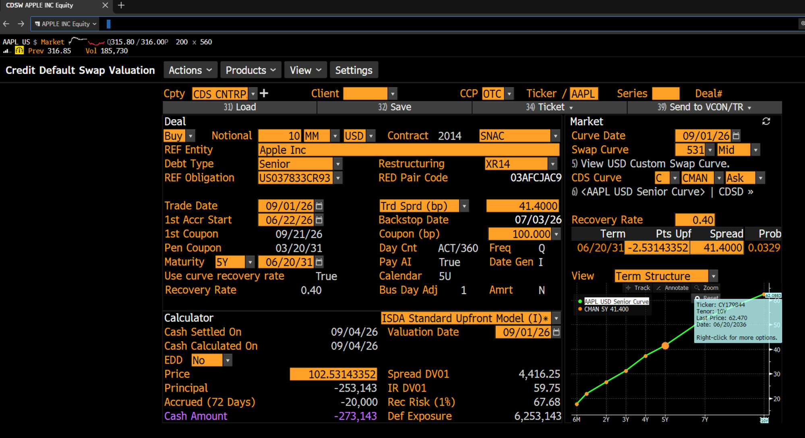
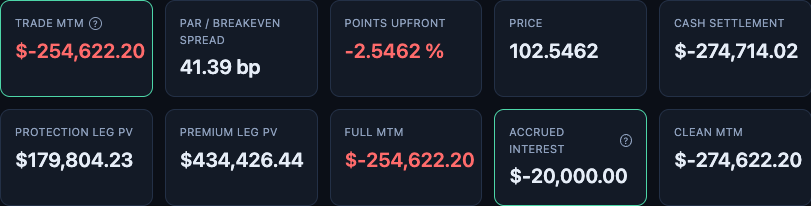

# CDS Pricing Dashboard

An ISDA-aligned single-name Credit Default Swap pricing engine, with an
interactive Flask + Plotly dashboard.

The project has two parts:

1. **A pricing engine** implementing real ISDA/SNAC market conventions --
   hazard-rate bootstrapping, closed-form protection-leg pricing, exact
   accrual-on-default, and a full standard-contract schedule (IMM maturity
   dates, T+1 step-in, T+3 cash-settle, real accrued interest).
2. **A dashboard** that makes the engine's mechanics visible -- node-by-node
   curve-building animations, the actual substituted arithmetic behind each
   calibration step, payment schedules, and KPI cards with hover breakdowns
   -- rather than a black box that only returns a final number.

The dashboard prices a real, on-the-run single-name CDS end-to-end under
actual ISDA/SNAC conventions for any standard tenor (6M-10Y) -- the specific
scenario validated below (see "Validation against a real Bloomberg screen")
uses a live Apple Inc 5Y trade with real market data, since that's the tenor
of the Bloomberg screen it's checked against.

## Validation against a real Bloomberg screen

The standard-contract path was checked line-by-line against a real Bloomberg
CDSW screen for a live Apple Inc 5Y CDS trade (trade date 2026-08-31, 100bp
fixed coupon, $10mm notional, 0.40 recovery). This is the main point of the
project: not just building a pricer, but validating it against an industry
reference and being precise about what matches and what doesn't.



*Screenshot taken 2026-09-01, before market open, so the quoted market data
still reflects 2026-08-31's close -- which is why the dashboard's own default
trade date is set to 2026-08-31, one day earlier than the "Trade Date" field
printed on this screen.*

This dashboard's own output for the same trade, side by side with the screen
above so the numbers can be checked directly rather than taken on faith:



These aren't just illustrative numbers -- they're the dashboard's actual
pre-loaded defaults on page load (Contract panel and Market Data tables), so
running it yourself with no changes reproduces this exact comparison. Two
different sources feed those defaults, with two different levels of
confidence: the CDS spread curve (6M-10Y) is transcribed directly from a real
Bloomberg CDSW/HP screen for Apple Inc; the OIS/discount curve comes from a
separate historical dataset whose original vendor isn't confirmed to be
Bloomberg -- it was only spot-checked once against a live independent source
(CheckMySwap) for the most recent date, not validated against Bloomberg
itself.

**What matches:**
- Par spread: 41.39bp vs. Bloomberg's 41.40bp (0.02bp)
- Maturity date and full coupon schedule: exact match, after finding and
  fixing a bug where the maturity anchor was computed from the trade date
  instead of the most recent IMM roll date
- Accrued interest: -$20,000 vs. Bloomberg's -$20,000 (exact)

**What doesn't (yet):** the upfront payment / price is off by about 0.58%
($1,479 on $10mm notional). Three plausible causes were tested and ruled
out with actual computed numbers, not assumptions: a real US holiday
calendar vs. weekend-only rolling (no coupon date in this schedule falls on
a US holiday, so this is a $0 effect), the `protectStart` half-day
convention (~$24 effect, too small), and OIS curve source differences
(would require a ~25bp curve error to explain the gap; only ~3-5bp was
observed against an independent live source). The cause of this remaining
gap is not yet confirmed -- documented as an open, quantified discrepancy
rather than hidden or hand-waved.

## Running it

```bash
pip install -r requirements.txt
python3 app.py
```

Then open `http://127.0.0.1:5050`.

Run the test suite (64 tests):

```bash
python3 -m pytest
```

## Project structure

```
engine/           Core pricing library (curves, bootstrap, day counts, pricing formulas)
scripts/          Entry-point script for pricing the standard contract
dashboard/        Glue layer between the Flask routes and engine/scripts
app.py            Flask application
templates/, static/   Dashboard frontend (HTML/CSS/JS, Plotly.js)
tests/            pytest suite (64 tests)
docs/             Reference material (Bloomberg screenshot, dashboard output, used above)
```

## Known limitations / possible next steps

- CS01 / spread-sensitivity analysis: deferred, not yet built.
- Real Bloomberg/Capital IQ file upload: shelved for now (the dashboard's
  market-data tables can still be edited by hand).
- The `protectStart` ISDA half-day flag is measured but not fully
  implemented, since its exact semantics could only be verified against
  unofficial reimplementations of ISDA's reference code, not the official
  source.
- The 0.58% upfront-payment gap against Bloomberg described above remains
  open.
- Index CDS (e.g. CDX, iTraxx) pricing: not built. The engine currently only
  prices single-name CDS -- an index trades against a basket of names under
  its own conventions (index-level flat spread quoting, basket loss/recovery
  treatment) that this codebase doesn't yet model. Real historical CDX spread
  data has already been gathered and would be a natural starting dataset for
  this.
